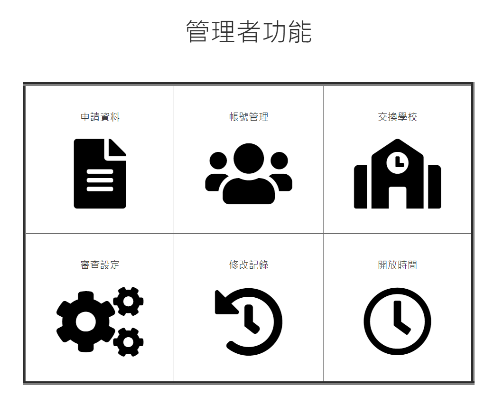
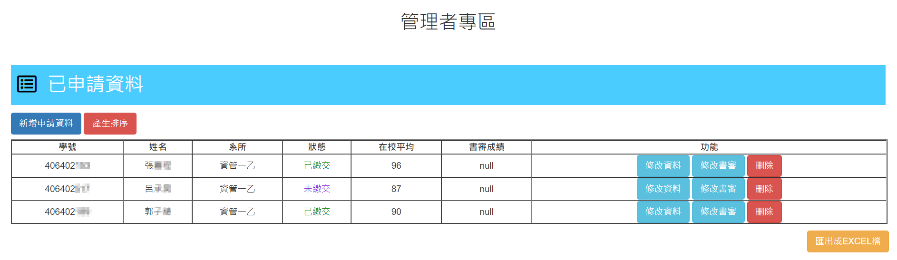
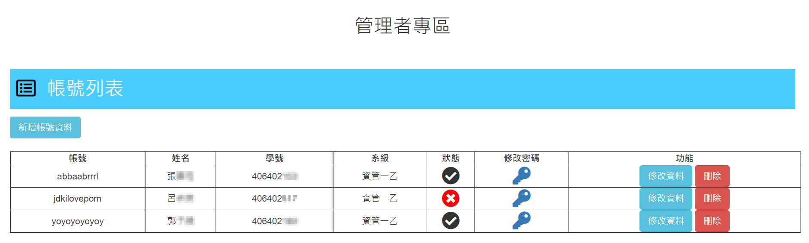
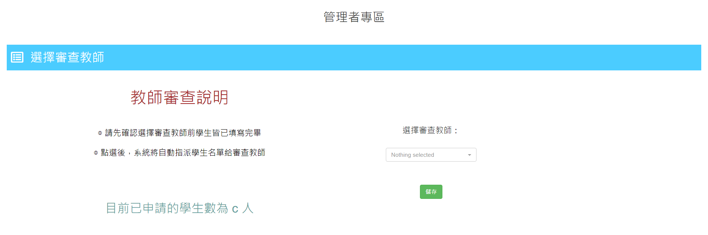
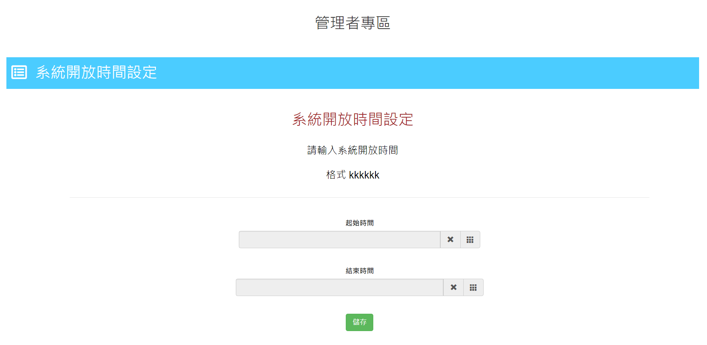

# 交換生申請系統（管理者端） Exchange Student Application System

為簡易交換生統管理者介面端

使用JavaScript、HTML、CSS撰寫

## 功能

* 申請資料查詢
* 帳號管理
* 交換學校管理
* 審查設定
* 修改Log
* 開放時間設定

## 介面

功能首頁

審查資料頁面

帳號管理頁面

審查設定頁面 (設定查查者)

開放時間設定頁面

